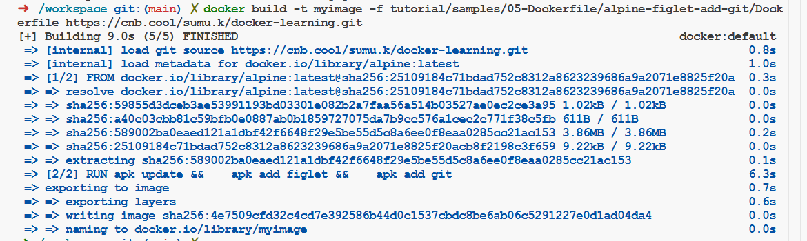

# Dockerfile 简介

前面从容器创建镜像的方式虽然简单易懂，但是如果涉及版本迭代的时候， 比如下次我需要再额外安装一个 git 命令，就需要重新 commit 一个容器，然后重新 tag 一个镜像， 这样比较麻烦，而且容易出错。因此，我们需要一种更加灵活的镜像创建方式，这就是 Dockerfile。

## 一、什么是 Dockerfile

Dockerfile 是一个文本文件，文本内容包含了一条条构建镜像所需的指令和说明。


## 二、docker build

### 1. 命令说明

`docker build` 命令通过读取 Dockerfile 中定义的指令，逐步构建镜像，并将最终结果保存到本地镜像库中。基本语法如下：

```shell
docker build [OPTIONS] PATH | URL | -
```

- **`PATH`**: 包含 Dockerfile 的目录路径或 `.`（当前目录）。
- **`URL`**: 指向包含 Dockerfile 的远程存储库地址（如 Git 仓库）。
- **`-`**: 从标准输入读取 Dockerfile。

【OPTIONS】

- **`-t, --tag`**: 为构建的镜像指定名称和标签。
- **`-f, --file`**: 指定 Dockerfile 的路径（默认是 `PATH` 下的 `Dockerfile`）。
- **`--build-arg`**: 设置构建参数。
- **`--no-cache`**: 不使用缓存层构建镜像。
- **`--rm`**: 构建成功后删除中间容器（默认开启）。
- **`--force-rm`**: 无论构建成功与否，一律删除中间容器。
- **`--pull`**: 始终尝试从注册表拉取最新的基础镜像。

### 2. 使用示例

```dockerfile
FROM alpine:latest
RUN apk update &&\
    apk add figlet &&\
    apk add git
```

使用如下命令构建：

```shell
docker build -t figlet-demo .
```

## 三、构建上下文

### 1. 什么是构建上下文

构建上下文是构建可以访问的一组文件。传递给构建命令的位置参数指定要用于构建的上下文。

```shell
 docker build [OPTIONS] PATH | URL | -
                         ^^^^^^^^^^^^^^
```

我们可以将以下任何输入作为构建的上下文：

- 本地目录的相对或绝对路径
- Git 仓库、压缩包或纯文本文件的远程 URL
- 通过标准输入管道传输到 `docker build` 命令的纯文本文件或压缩包

> Tips：这一部分演示会提前用到 COPY 指令，COPY 指令使用的时候基础路径就是这里的上下文路径。

#### 1.1 [文件系统上下文](https://docs.docker.top/build/concepts/context/index.htm#filesystem-contexts)

当构建上下文是本地目录、远程 Git 仓库或 tar 文件时，这将成为构建器在构建过程中可以访问的文件集。`COPY` 和 `ADD` 等构建指令可以引用上下文中的任何文件和目录。

文件系统构建上下文会递归处理。

- 当指定本地目录或压缩包时，将包含所有子目录。
- 当指定远程 Git 仓库时，将包含仓库和所有子模块。

有关可以与构建一起使用的不同类型的文件系统上下文的更多信息，请参阅

- [本地文件](https://docs.docker.top/build/concepts/context/index.htm#local-context)
- [Git 仓库](https://docs.docker.top/build/concepts/context/index.htm#git-repositories)
- [远程压缩包](https://docs.docker.top/build/concepts/context/index.htm#remote-tarballs)

#### 1.2 [文本文件上下文](https://docs.docker.top/build/concepts/context/index.htm#text-file-contexts)

当构建上下文是纯文本文件时，构建器会将该文件解释为 Dockerfile。使用这种方法，构建不会使用文件系统上下文。

更多信息，请参阅 [空构建上下文](https://docs.docker.top/build/concepts/context/index.htm#empty-context)。

### 2. 本地上下文

要使用本地构建上下文，可以将相对或绝对文件路径指定给 `docker build` 命令。以下示例显示一个使用当前目录 (`.`) 作为构建上下文的构建命令：

```shell
 docker build .
...
16 [internal] load build context
16 sha256:23ca2f94460dcbaf5b3c3edbaaa933281a4e0ea3d92fe295193e4df44dc68f85
16 transferring context: 13.16MB 2.2s done
...
```

这使得当前工作目录中的文件和目录可供构建器使用。构建器会在需要时从构建上下文加载它所需的文件。还可以使用本地压缩包作为构建上下文，方法是将压缩包内容管道传输到 `docker build` 命令。请参阅 [压缩包](https://docs.docker.top/build/concepts/context/index.htm#local-tarballs)。

#### 2.1 [本地目录](https://docs.docker.top/build/concepts/context/index.htm#local-directories)

有以下目录结构：

```text
.
├── index.ts
├── src/
├── Dockerfile
├── package.json
└── package-lock.json
```

如果将此目录作为上下文传递，则 Dockerfile 指令可以引用和包含这些文件以进行构建。

```dockerfile
# syntax=docker/dockerfile:1
FROM node:latest
WORKDIR /src
COPY package.json package-lock.json .
RUN npm ci
COPY index.ts src .
```

可以用下面的命令构建：

```shell
docker build -t concept .
```

#### 2.2 [带有来自标准输入的 Dockerfile 的本地上下文](https://docs.docker.top/build/concepts/context/index.htm#local-context-with-dockerfile-from-stdin)

使用以下语法使用本地文件系统上的文件构建镜像，同时使用来自标准输入的 Dockerfile：

```shell
docker build -f- PATH
```

此语法使用 -f（或 --file）选项指定要使用的 Dockerfile，并使用连字符 (-) 作为文件名来指示 Docker 从标准输入读取 Dockerfile。

以下示例使用当前目录 (.) 作为构建上下文，并使用通过使用 here-document 传递的 Dockerfile 构建镜像。

```shell
# create a directory to work in
mkdir example
cd example

# create an example file
touch somefile.txt

# build an image using the current directory as context
# and a Dockerfile passed through stdin
docker build -t myimage:latest -f- . <<EOF
FROM busybox
COPY somefile.txt ./
RUN cat /somefile.txt
EOF
```

#### 2.3 [本地压缩包](https://docs.docker.top/build/concepts/context/index.htm#local-tarballs)

当我们将压缩包管道传输到构建命令时，构建会使用压缩包的内容作为文件系统上下文。例如，给定以下项目目录：

```shell
.
├── Dockerfile
├── Makefile
├── README.md
├── main.c
├── scripts
├── src
└── test.Dockerfile
```

可以创建目录的压缩包并将其管道传输到构建以用作上下文：

```shell
tar czf foo.tar.gz *
docker build - < foo.tar.gz
```

构建会从压缩包上下文中解析 Dockerfile。我们可以使用 `--file` 标志指定相对 于压缩包根目录的 Dockerfile 的名称和位置。以下命令使用压缩包中的 `test.Dockerfile` 进行构建：

```shell
docker build --file test.Dockerfile - < foo.tar.gz
```

### 3. [远程上下文](https://docs.docker.top/build/concepts/context/index.htm#remote-context)

还可以指定远程 Git 仓库、压缩包或纯文本文件的地址作为构建上下文。

- 对于 Git 仓库，构建器会自动克隆仓库。请参阅 [Git 仓库](https://docs.docker.top/build/concepts/context/index.htm#git-repositories)。
- 对于压缩包，构建器会下载并解压缩压缩包的内容。请参阅 [压缩包](https://docs.docker.top/build/concepts/context/index.htm#remote-tarballs)。

如果远程压缩包是文本文件，则构建器将不会接收 [文件系统上下文](https://docs.docker.top/build/concepts/context/index.htm#filesystem-contexts)，而是假设远程文件是 Dockerfile。请参阅 [空构建上下文](https://docs.docker.top/build/concepts/context/index.htm#empty-context)。

#### 3.1 [Git 仓库](https://docs.docker.top/build/concepts/context/index.htm#git-repositories)

##### 3.1.1 基本用法

当我们将指向 Git 仓库位置的 URL 作为参数传递给 `docker build` 时，构建器会使用该仓库作为构建上下文。构建器会执行仓库的浅克隆，**只下载 HEAD 提交，而不是整个历史记录**。构建器会递归克隆仓库及其包含的任何子模块。

```shell
docker build https://github.com/user/myrepo.git
```

默认情况下，构建器会克隆指定存储库的默认分支上的最新提交。例如，我有一个 cnb 仓库：[sumu.k/docker-learning](https://cnb.cool/sumu.k/docker-learning)，这个仓库中有这样一个 dockerfile 文件：[tutorial/samples/05-Dockerfile/alpine-figlet-add-git/Dockerfile](https://cnb.cool/sumu.k/docker-learning/-/blob/main/tutorial/samples/05-Dockerfile/alpine-figlet-add-git/Dockerfile)，我们使用这个远程 git 仓库的 dockerfile 文件进行构建，我们执行以下命令：

```shell
docker build -t myimage -f tutorial/samples/05-Dockerfile/alpine-figlet-add-git/Dockerfile https://cnb.cool/sumu.k/docker-learning.git
```

会有如下打印信息：



##### 3.1.2 [URL 片段](https://docs.docker.top/build/concepts/context/index.htm#url-fragments)

可以将 URL 片段附加到 Git 存储库地址，以使构建器克隆存储库的特定分支、标签和子目录。URL 片段的格式为 `#ref:dir`，其中

- `ref` 是分支、标签或提交哈希的名称
- `dir` 是存储库内的子目录

例如，以下命令使用 `container` 分支和该分支中的 `docker` 子目录作为构建上下文

```shell
docker build https://github.com/user/myrepo.git#container:docker
```

下表列出了所有有效的后缀及其构建上下文

| 构建语法后缀                   | 使用的提交              | 使用的构建上下文 |
| ------------------------------ | ----------------------- | ---------------- |
| `myrepo.git`                   | `refs/heads/<默认分支>` | `/`              |
| `myrepo.git#mytag`             | `refs/tags/mytag`       | `/`              |
| `myrepo.git#mybranch`          | `refs/heads/mybranch`   | `/`              |
| `myrepo.git#pull/42/head`      | `refs/pull/42/head`     | `/`              |
| `myrepo.git#:myfolder`         | `refs/heads/<默认分支>` | `/myfolder`      |
| `myrepo.git#master:myfolder`   | `refs/heads/master`     | `/myfolder`      |
| `myrepo.git#mytag:myfolder`    | `refs/tags/mytag`       | `/myfolder`      |
| `myrepo.git#mybranch:myfolder` | `refs/heads/mybranch`   | `/myfolder`      |

当使用提交哈希作为 URL 片段中的 `ref` 时，请使用提交的完整 40 字符 SHA-1 哈希字符串。不支持简短哈希，例如截断为 7 个字符的哈希。

```shell
# ✅ The following works:
docker build github.com/docker/buildx#d4f088e689b41353d74f1a0bfcd6d7c0b213aed2
# ❌ The following doesn't work because the commit hash is truncated:
docker build github.com/docker/buildx#d4f088e
```

##### 3.1.3 [保留 `.git` 目录](https://docs.docker.top/build/concepts/context/index.htm#keep-git-directory)

默认情况下，BuildKit 在使用 Git 上下文时不会保留 `.git` 目录。可以通过设置 [`BUILDKIT_CONTEXT_KEEP_GIT_DIR` 构建参数](https://docs.docker.top/reference/dockerfile/index.htm#buildkit-built-in-build-args) 来配置 BuildKit 保留该目录。如果想在构建过程中检索 Git 信息，这将非常有用。

```dockerfile
# syntax=docker/dockerfile:1
FROM alpine
WORKDIR /src
RUN --mount=target=. \
  make REVISION=$(git rev-parse HEAD) build
```

使用如下命令进行

```shell
docker build \
 --build-arg BUILDKIT_CONTEXT_KEEP_GIT_DIR=1
 https://github.com/user/myrepo.git#main
```

##### 3.1.4 [私有存储库](https://docs.docker.top/build/concepts/context/index.htm#private-repositories)

当指定一个也是私有存储库的 Git 上下文时，构建器需要我们提供必要的身份验证凭据。可以使用 SSH 或基于令牌的身份验证。如果指定的 Git 上下文是 SSH 或 Git 地址，Buildx 会自动检测并使用 SSH 凭据。默认情况下，这使用 `$SSH_AUTH_SOCK`。可以使用 [`--ssh` 标志](https://docs.docker.top/reference/cli/docker/buildx/build/index.htm#ssh) 配置要使用的 SSH 凭据。

```shell
docker buildx build --ssh default git@github.com:user/private.git
```

如果想改用基于令牌的身份验证，可以使用 [`--secret` 标志](https://docs.docker.top/reference/cli/docker/buildx/build/index.htm#secret) 传递令牌。

```shell
GIT_AUTH_TOKEN=<token> docker buildx build \
 --secret id=GIT_AUTH_TOKEN \
 https://github.com/user/private.git
```

> **注意**：不要将 `--build-arg` 用于密钥。

#### 3.2 [带有来自标准输入的 Dockerfile 的远程上下文](https://docs.docker.top/build/concepts/context/index.htm#remote-context-with-dockerfile-from-stdin)

使用以下语法使用本地文件系统上的文件构建镜像，同时使用来自标准输入的 Dockerfile：

```shell
docker build -f- URL
```

此语法使用 -f（或 --file）选项指定要使用的 Dockerfile，并使用连字符 (`-`) 作为文件名来指示 Docker 从标准输入读取 Dockerfile。这在我们想从不包含 Dockerfile 的存储库构建镜像，或者想使用自定义 Dockerfile 构建而无需维护我们自己的存储库分支的情况下非常有用。以下示例使用来自标准输入的 Dockerfile 构建镜像，并添加来自 [hello-world](https://github.com/docker-library/hello-world) GitHub 存储库的 `hello.c` 文件。

```shell
docker build -t myimage:latest -f- https://github.com/docker-library/hello-world.git <<EOF
FROM busybox
COPY hello.c ./
EOF
```

#### 3.3 [远程压缩包](https://docs.docker.top/build/concepts/context/index.htm#remote-tarballs)

如果传递到远程 tarball 的 URL，则 URL 本身将发送到构建器。

```shell
docker build http://server/context.tar.gz
```

一般会看到如下打印信息：

```shell
1 [internal] load remote build context
1 DONE 0.2s

2 copy /context /
2 DONE 0.1s
...
```

下载操作将在运行 BuildKit 守护程序的主机上执行。请注意，如果我们使用的是远程 Docker 上下文或远程构建器，这并不一定与我们发出构建命令的机器相同。BuildKit 获取 `context.tar.gz` 并将其用作构建上下文。Tarball 上下文必须符合标准 `tar` Unix 格式的 tar 存档，并且可以使用 `xz`、`bzip2`、`gzip` 或 `identity`（无压缩）中的任何一种格式进行压缩。

## 四、一个简单示例

### 1. Dockerfile

```dockerfile
FROM alpine:latest
RUN apk update &&\
    apk add figlet
```

### 2. 制作镜像

我们来使用 Dockerfile 来完成前面做的同样的事情，最后使用 `docker build` 命令来构建镜像。

```shell
docker build -t alpine-figlet-from-dockerfile .
```

同样可以使用这个镜像

```shell
docker run alpine-figlet-from-dockerfile figlet "hello docker"
```

这样当我们需要安装 git 的时候，只需要修改 Dockerfile 中的命令后重新构建镜像即可。

```shell
docker build -t alpine-figlet-from-dockerfile .
docker run alpine-figlet-from-dockerfile git
```

## 五、小结

### 1. Dockerfile 到底是什么呢？

Dockerfile 是一种静态文件，用来声明镜像的内容。

### 2. 它为什么如此重要呢？

Dockerfile 给容器化实践提供了一种规范，让创建镜像的操作简单化，标准化。 简单化让开发者可以快速上手，标准化让镜像可以重复使用，可移植，可复用。这些好处从侧面上推动了 Docker 的普及。

> 参考资料：
>
> [构建上下文 | Docker 文档](https://docs.docker.top/build/concepts/context/index.htm)
