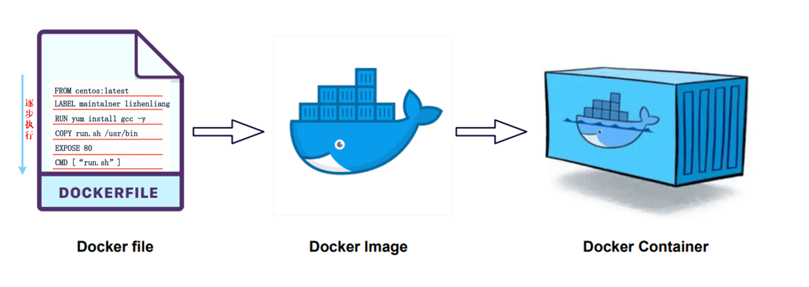

# Dockerfile 简介

前面从容器创建镜像的方式虽然简单易懂，但是如果涉及版本迭代的时候， 比如下次我需要再额外安装一个 git 命令，就需要重新 commit 一个容器，然后重新 tag 一个镜像， 这样比较麻烦，而且容易出错。因此，我们需要一种更加灵活的镜像创建方式，这就是 Dockerfile。 

## 一、什么是 Dockerfile

Dockerfile 是一个文本文件，文本内容包含了一条条构建镜像所需的指令和说明。



## 二、docker build

`docker build` 命令通过读取 Dockerfile 中定义的指令，逐步构建镜像，并将最终结果保存到本地镜像库中。基本语法如下：

```shell
docker build [OPTIONS] PATH | URL | -
```

- **`PATH`**: 包含 Dockerfile 的目录路径或 `.`（当前目录）。
- **`URL`**: 指向包含 Dockerfile 的远程存储库地址（如 Git 仓库）。
- **`-`**: 从标准输入读取 Dockerfile。

【OPTIONS】

- **`-t, --tag`**: 为构建的镜像指定名称和标签。
- **`-f, --file`**: 指定 Dockerfile 的路径（默认是 `PATH` 下的 `Dockerfile`）。
- **`--build-arg`**: 设置构建参数。
- **`--no-cache`**: 不使用缓存层构建镜像。
- **`--rm`**: 构建成功后删除中间容器（默认开启）。
- **`--force-rm`**: 无论构建成功与否，一律删除中间容器。
- **`--pull`**: 始终尝试从注册表拉取最新的基础镜像。

## 三、一个简单示例

### 1. Dockerfile

```dockerfile
FROM alpine:latest
RUN apk update &&\
    apk add figlet
```

### 2. 制作镜像

我们来使用 Dockerfile 来完成前面做的同样的事情，最后使用 `docker build` 命令来构建镜像。

```shell
docker build -t alpine-figlet-from-dockerfile .
```

同样可以使用这个镜像

```shell
docker run alpine-figlet-from-dockerfile figlet "hello docker"
```

这样当我们需要安装 git 的时候，只需要修改 Dockerfile 中的命令后重新构建镜像即可。

```shell
docker build -t alpine-figlet-from-dockerfile .
docker run alpine-figlet-from-dockerfile git
```

## 四、小结

### 1. Dockerfile 到底是什么呢？

Dockerfile是一种静态文件，用来声明镜像的内容。

### 2. 它为什么如此重要呢？

Dockerfile给容器化实践提供了一种规范，让创建镜像的操作简单化，标准化。 简单化让开发者可以快速上手，标准化让镜像可以重复使用，可移植，可复用。这些好处从侧面上推动了Docker的普及。
