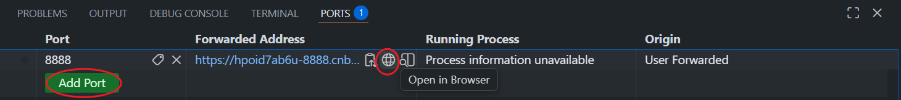

# 应用实例

## 一、构建一个 jupyter notebook 镜像

### 1. jupyter notebook 简介

#### 1.1 是什么？

> Jupyter Notebook 是基于网页的用于交互计算的应用程序。其可被应用于全过程计算：开发、文档编写、运行代码和展示结果。——[The Jupyter Notebook — Jupyter Notebook 7.5.4 documentation](https://jupyter-notebook.readthedocs.io/en/stable/notebook.html)

简单来说，Jupyter Notebook 是一个 **基于网页的交互式计算环境**，我们可以把它想象成一个智能笔记本：

- **写笔记**：像用 Word 一样，在里面记录文字、公式和图片。
- **写代码并运行**：直接在单元格里编写 Python 代码，点击运行就能立刻看到结果。
- **展示结果**：代码生成的图表、数据表格会直接显示在笔记本中。

Jupyter Notebook 特别适合用于 **数据清洗、统计分析、机器学习模型训练和可视化**，因为你可以在一个文档中完成代码、结果和思路说明的全部工作。

#### 1.2 有什么特点？

① 编程时具有**语法高亮**、缩进、tab补全的功能。

② 可直接通过浏览器运行代码，同时在代码块下方展示运行结果。

③ 以富媒体格式展示计算结果。富媒体格式包括：HTML，LaTeX，PNG，SVG等。

④ 对代码编写说明文档或语句时，支持Markdown语法。

⑤ 支持使用LaTeX编写数学性说明。

### 2. 构建镜像

我们编写dockerfile如下：

- [Dockerfile](../samples/05-Dockerfile/jupyter_sample/Dockerfile)

```dockerfile
FROM python:3.10-slim

# 安装系统依赖
RUN apt-get update && \
    apt-get install -y --no-install-recommends \
    curl \
    && rm -rf /var/lib/apt/lists/*

# 安装 Python 包
RUN pip install --no-cache-dir \
    jupyterlab==4.4.3 \
    pandas==2.3.0 \
    numpy==1.26.2 \
    matplotlib==3.8.2

# 安装 Jupyter 内核
RUN pip install --no-cache-dir \
    ipykernel==6.29.0 \
    && python -m ipykernel install --name python3

# 设置工作目录并初始化笔记本
WORKDIR /notebooks
COPY sample-notebook.ipynb .

# 暴露 Jupyter 端口
EXPOSE 8888

# 启动命令
CMD ["jupyter", "lab", "--ip=0.0.0.0", "--allow-root", "--no-browser", "--NotebookApp.token=''", "--NotebookApp.disable_check_xsrf=True"]
```

执行以下命令创建镜像：

```shell
cd /workspace/tutorial/samples/05-Dockerfile
docker build -t jupyter-sample jupyter_sample/
```

该镜像使用 RUN 指令来安装 jupyter notebook，使用 WORKDIR 指令设置工作目录， 使用 COPY 指令将代码复制到镜像中，使用 EXPOSE 指令来暴露端口， 最后使用 CMD 指令来启动 jupyter notebook 服务。

### 3. 运行镜像

使用上述镜像来启动 jupyter notebook 服务:

```shell
docker run -d -p 8888:8888  jupyter-sample
```

我们使用了 -p 参数来将容器内的 8888 端口映射到宿主机的 8888 端口，在 cnb 上我们可以通过添加一个端口映射来实现外网访问。



点击这个浏览器图标，就可以访问 jupyter notebook 服务了。

## 二、多阶段构建来打包 golang 应用

Go语言采用静态编译机制，将程序及其依赖的运行时库（如垃圾回收、调度器）全部打包为单一可执行文件。这一特性显著简化了部署流程，无需在目标机器上预装运行环境。所以我们不熟go的应用的时候，只需要将最终的可执行文件放到目标机器上就可以运行了，并不需要整个go开发环境。

在实际开发中，我们经常需要构建 golang 应用。 如果使用传统的单阶段构建，最终的镜像会包含整个 Go 开发环境，导致镜像体积非常大。 通过多阶段构建，我们可以创建一个非常小的生产镜像。

### 1. 准备文件

#### 1.1 [main.go](../samples/05-Dockerfile/golang_sample/main.go)

```go
package main

import (
	"fmt"
	"log"
	"net/http"
	"os"
)

func main() {
	port := os.Getenv("PORT")
	if port == "" {
		port = "8080" // 默认端口
	}

	http.HandleFunc("/", func(w http.ResponseWriter, r *http.Request) {
		fmt.Fprintf(w, "Hello, Docker Build!")
	})

	log.Printf("Server starting on port %s...\n", port)
	if err := http.ListenAndServe(":"+port, nil); err != nil {
		log.Fatal(err)
	}
}
```

#### 1.2 [Dockerfile.single](../samples/05-Dockerfile/golang_sample/Dockerfile.single)

```dockerfile
FROM golang:1.23

# 定义构建参数
ARG PORT=8080
# 设置环境变量
ENV PORT=${PORT}

WORKDIR /app

COPY go.mod .
COPY main.go .

ENV CGO_ENABLED=0
ENV GOOS=linux

RUN go mod tidy && go build -ldflags="-w -s" -o server .

EXPOSE ${PORT}

CMD ["./server"]
```


#### 1.3 [Dockerfile.multi](../samples/05-Dockerfile/golang_sample/Dockerfile.multi)

```dockerfile
# 第一阶段：构建阶段
FROM golang:1.23 AS builder

# 设置工作目录
WORKDIR /app

# 将源代码复制到容器中
COPY go.mod .
COPY main.go .

# 设置必要的 Go 环境变量
ENV CGO_ENABLED=0
ENV GOOS=linux

# 编译 Go 应用
RUN go mod tidy && go build -ldflags="-w -s" -o server .

# 第二阶段：运行阶段
FROM alpine:latest

# 定义构建参数
ARG PORT=8081
# 设置环境变量
ENV PORT=${PORT}

# 安装 CA 证书，这在某些需要 HTTPS 请求的应用中可能需要
RUN apk --no-cache add ca-certificates

# 设置工作目录
WORKDIR /root/

# 从 builder 阶段复制编译好的二进制文件
COPY --from=builder /app/server .

# 暴露应用端口
EXPOSE ${PORT}

# 运行应用
CMD ["./server"]
```

#### 1.4 [go.mod](../samples/05-Dockerfile/golang_sample/go.mod)

```go
module golang_sample

go 1.23.3
```

### 2. 构建镜像

```shell
cd /workspace/tutorial/samples/05-Dockerfile

docker build -t golang-demo-single -f golang_sample/Dockerfile.single golang_sample/
docker build -t golang-demo-multe -f golang_sample/Dockerfile.multi golang_sample/
```

### 3. 运行镜像

```shell
docker run -d -p 8080:8080 golang-demo-single
docker run -d -p 8081:8081 golang-demo-multe
```

容器运行成功后可以通过如下命令行来访问，可以看到两个容器都是在运行我们写的 golang 服务。

```shell
curl http://localhost:8080
curl http://localhost:8081
```

### 4. 镜像大小

让我们来对比一下单阶段构建和多阶段构建的区别：

```shell
# 查看镜像大小
docker images | grep golang-demo
```

你会发现最终的镜像只有几十 MB，而如果使用单阶段构建（直接使用 golang 镜像），镜像大小会超过 1GB。这就是多阶段构建的优势：

- 最终镜像只包含运行时必需的文件
- 不包含源代码和构建工具，提高了安全性
- 大大减小了镜像体积，节省存储空间和网络带宽

这种构建方式特别适合 Go 应用，因为 Go 可以编译成单一的静态二进制文件。在实际开发中，我们可以使用这种方式来构建和部署高效的容器化 Go 应用。