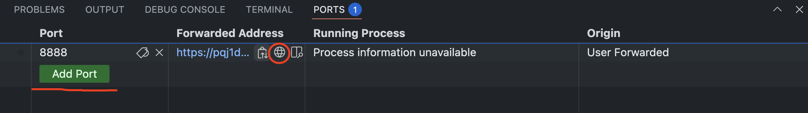

## 应用实例

##  一、使用 docker compose 构建 Todo 应用

在本章节中，我们将创建一个完整的 Todo 应用，包含以下组件：

- **Nginx**: 路由转发
- **前端**: React 应用
- **后端**: Node.js API 服务
- **数据库**: MongoDB

### 1. 项目结构

```text
.
├── docker-compose.yml    # Compose 配置文件
├── nginx/                # nginx
├── frontend/            # React 前端应用
└── backend/             # Node.js 后端服务
```

### 2. 架构图

```text
                ┌─────────────┐
                │   Nginx     │
                │   :8080     │
                └─────┬───────┘
                      │
             ┌────────┴───────┐
             │                │
     ┌───────▼─────┐   ┌──────▼──────┐
     │  Frontend   │   │   Backend   │
     │  (React)    │   │  (Node.js)  │
     │   :3000     │   │    :3001    │
     └─────────────┘   └──────┬──────┘
                              │
                      ┌───────▼───────┐
                      │   MongoDB     │
                      │  Database     │
                      │    :27017     │
                      └───────────────┘
```

### 3. Docker Compose 配置解析

#### 3.1 服务定义

<table>
    <tbody>
      <tr>
        <th align="center">服务</th>
        <th align="center">描述</th>
      </tr>
      <tr>
        <td align="center"><b>nginx 服务</b></td>
        <td>- 使用官方 nginx 镜像<br>- 映射端口 8080，作为应用的访问入口<br>- 将 nginx.conf 配置文件打包进镜像</td>
      </tr>
      <tr>
        <td align="center"><b>frontend 服务</b></td>
        <td>- 使用本地 Dockerfile 构建<br>- 暴露端口 3000，仅容器网络访问<br>- 设置 API URL 环境变量<br>- 依赖于 backend 服务<br>- 使用卷挂载实现热重载</td>
      </tr>
      <tr>
        <td align="center"><b>backend 服务</b></td>
        <td>- 使用本地 Dockerfile 构建<br>- 映射端口 3001，仅容器网络访问<br>- 设置 MongoDB 连接环境变量<br>- 依赖于 mongodb 服务<br>- 使用卷挂载实现热重载</td>
      </tr>
      <tr>
        <td align="center"><b>mongodb 服务</b></td>
        <td>- 使用官方 MongoDB 镜像<br>- 映射端口 27017，仅容器网络访问<br>- 使用命名卷持久化数据</td>
      </tr>
    </tbody>
</table>

#### 3.2 网络配置

- Docker Compose 会自动创建一个默认网络 (bridge 模式)
- 所有服务都在同一网络中
- 服务可以通过服务名互相访问

#### 3.3 数据持久化

- 使用命名卷 `mongodb_data` 持久化数据库数据
- 使用绑定挂载实现开发时的代码热重载

### 4. 使用说明

```bash
docker compose up -d #在后台启动服务

docker compose ps # 查看服务状态

# 查看服务日志
docker compose logs frontend
docker compose logs backend
docker compose logs mongodb

docker compose down # 停止所有服务

docker compose build # 重新构建服务

docker compose restart frontend # 重启单个服务
```

## 二、访问应用



我们使用了在 nginx 这里配置了 8080 端口作为 todo 应用的整体入口， 在 cnb 上我们可以通过添加一个 8080 的端口映射来实现外网访问, 可以按照如下步骤来配置。