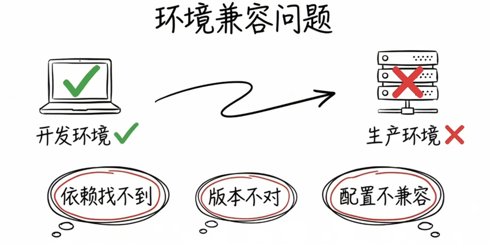
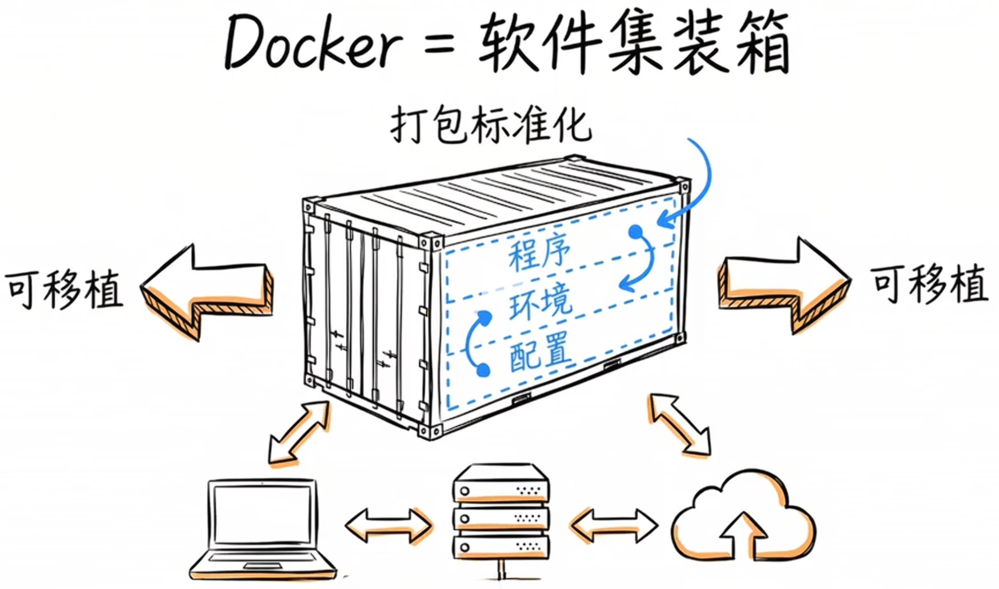
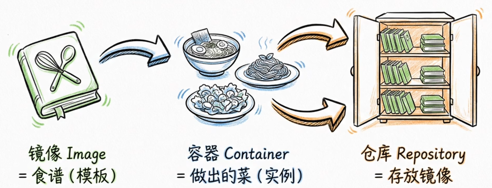

# Docker 学习文档

## 一、Docker 简介

### 1.什么是docker

#### 1.1 一个场景

我们现在开发了一个程序，就拿嵌入式中的 uboot 来说，比如现在这个硬件平台要求我用 uboot2016.03 版本，那么我只能去官网下载这个版本然后在我自己的虚拟机中的 ubuntu18.04 中编译，在编译过程中，一切正常，然后得到了成果物，正常进行开发。

一段时间后，我由于一些不得已的原因，升级了虚拟机的 ubuntu，升级到了 ubuntu22.04，结果这个时候重新编译，完啦，报错了代码根本没动。

这是怎么回事？经过一番排查，原来是 ubuntu22.04 中安装的 gcc 版本默认为 11.4，而 ubuntu18.04 中默认安装的 gcc 为，在 uboot 编译过程中，需要使用 gcc 来编译出一些辅助工具，但是两个版本的 gcc 对于一些语法的支持是有一些区别的，这就直接产生了报错。这个时候我就需要修改源码或者安装旧版本的 gcc 了。

还有一些web的开发，或者Python程序的开发，有大量依赖的库，配置等，就更容易出现在我的电脑上好好的，到你的电脑上怎么就不行了的问题。这也是最容易遇到的环境配置问题。



#### 1.2 Docker

docker就解决了上面的痛点。docker用一句话概括就是：将应用程序以及其所需的全部环境打包成一个标准、轻量可移动的容器。docker就像给软件找了一个标准的集装箱，把程序、环境和配置一起打包进去，搬到哪里都能跑，做到一次构建处处运行。




Docker 是一个用于开发、发布和运行应用程序的开放平台。 Docker 使您能够将应用程序与基础设施分离，以便我们可以快速交付软件。借助 Docker，可以像管理应用程序一样管理基础设施。通过利用 Docker 的方法来传送、测试和部署代码，可以显着减少编写代码和在生产中运行代码之间的延迟。

### 2. Docker 概念



#### 2.1 容器(container)

什么是容器？简而言之，容器是每个应用程序组件的独立进程。每个组件（前端 React 应用程序、Python API 引擎和数据库）都在自己的隔离环境中运行，与计算机上的其他所有组件完全隔离。

这就是他们的出色之处。容器有以下特点：

- 独立的。每个容器都拥有其运行所需的一切，而不依赖于主机上预安装的任何依赖项。
- 孤立。由于容器是独立运行的，因此它们对主机和其他容器的影响最小，从而提高了应用程序的安全性。
- 独立的。每个容器都是独立管理的。删除一个容器不会影响其他任何容器。
- 便携的。容器可以在任何地方运行！在您的开发计算机上运行的容器将在数据中心或云中的任何地方以相同的方式工作！

> Tips：容器与虚拟机(VM)
>
> - 虚拟机是一个完整的操作系统，拥有自己的内核、硬件驱动程序、程序和应用程序。仅仅为了隔离单个应用程序而启动虚拟机会产生大量开销。
>
> - 容器只是一个独立的进程，包含它运行所需的所有文件。如果我们运行多个容器，它们都共享相同的内核，从而允许我们在更少的基础设施上运行更多应用程序。
>
> 很多时候，我们会看到容器和虚拟机一起使用。例如，在云环境中，配置的机器通常是虚拟机。然而，具有容器运行时的虚拟机可以运行多个容器化应用程序，而不是配置一台机器来运行一个应用程序，从而提高资源利用率并降低成本。

#### 2.2 镜像(image)

看到一个 [容器](https://docker.github.net.cn/guides/docker-concepts/the-basics/what-is-a-container/) 是一个孤立的进程，它从哪里获取它的文件和配置呢？我们如何共享这些环境？这就是容器镜像的用武之地！

容器映像是一个标准化包，其中包含运行容器的所有文件、二进制文件、库和配置。

对于 [PostgreSQL](https://hub.docker.com/_/postgres) 映像，该映像将打包数据库二进制文件、配置文件和其他依赖项。对于 Python Web 应用程序，它将包括 Python 运行时、我们的应用程序代码及其所有依赖项。

镜像有两个重要的原则：

- 镜像是不可变的。镜像一旦创建就无法修改。我们只能制作新镜像或在其上添加更改。
- 容器镜像由层组成。每个层代表一组添加、删除或修改文件的文件系统更改。

#### 2.3 注册表(registry)

现在我们已经知道什么是容器映像以及它是如何工作的，我们还可能想知道 - 将这些映像存储在哪里？

我们可以将容器映像存储在计算机系统上，但是如果想与朋友共享它们或在另一台计算机上使用它们怎么办？这就是镜像注册表的用武之地。

镜像注册表是用于存储和共享容器镜像的集中位置。它可以是公共的或私人的。 [Docker Hub](https://hub.docker.com/) 是一个任何人都可以使用的公共注册表，并且是默认注册表，我们可以用免费版本的 Docker Hub 创建一个私有存储库和无限个公共存储库。

虽然 Docker Hub 是一个流行的选项，但目前还有许多其他可用的容器注册表，包括 [Amazon Elastic Container Registry (ECR)](https://aws.amazon.com/ecr/)、 [Azure Container Registry (ACR)](https://azure.microsoft.com/en-in/products/container-registry) 和 [Google Container Registry (GCR)](https://cloud.google.com/artifact-registry)。我们甚至可以在本地系统或组织内部运行您的私有注册表。例如 Harbor、JFrog Artifactory、GitLab 容器注册中心等。

> Tips：注册表与存储库
>
> 使用注册表时，我们可能会听到 **注册表** 和 **存储库** 这两个术语，就好像它们是可以互换的一样。尽管它们有相关性，但它们并不完全相同。
>
> 注册表是存储和管理容器映像的集中位置，而存储库是注册表中相关容器映像的集合。将其视为一个文件夹，可以在其中根据项目组织图像。每个存储库都包含一个或多个容器映像。

#### 2.4 Docker Compose

现在我们想要做一些更复杂的事情 - 运行数据库、消息队列、缓存或各种其他服务。我们是否将所有内容安装在一个容器中？运行多个容器？如果运行多个，如何将它们连接在一起？

容器的一个最佳实践是每个容器应该做一件事并且做好。尽管这一规则也有例外，但还是尽量避免让一个容器执行多项操作的趋势。

我们可以使用多个 `docker run` 命令来启动多个容器。但是，很快就会意识到我们需要管理网络、将容器连接到这些网络所需的所有标志等等。完成后，清理工作会稍微复杂一些。

使用 Docker Compose，我们可以在单个 YAML 文件中定义所有容器及其配置。如果将此文件包含在代码存储库中，则 clone 这个存储库的任何人都可以使用单个命令启动并运行。

重要的是要理解 Compose 是一个声明性工具 - 我们只需定义它并运行即可。并不总是需要从头开始重新创建所有内容。如果我们进行了更改，可以 `docker compose up` 再次运行，Compose 将协调文件中的更改并智能地应用它们。

> Tips：Dockerfile 与 Compose 文件
>
> Dockerfile 提供构建容器映像的说明，而 Compose 文件则定义正在运行的容器。通常，Compose 文件会引用 Dockerfile 来构建用于特定服务的映像。

## 二、Docker 安装与卸载

>参考资料：[在 Ubuntu 上安装 Docker Engine](https://docker.cadn.net.cn/manuals/engine_install_ubuntu)、[Install Docker Engine on Ubuntu](https://docs.docker.com/engine/install/ubuntu/)

### 1. 卸载冲突的包

运行以下命令以卸载所有冲突的软件包：

```shell
sudo apt remove $(dpkg --get-selections docker.io docker-compose docker-compose-v2 docker-doc podman-docker containerd runc | cut -f1)
```

### 2. 使用脚本安装

这个可以参考：[docker/docker-install: Docker installation script](https://github.com/docker/docker-install)，我们执行下面的命令自动安装：

```shell
curl -fsSL https://get.docker.com -o get-docker.sh
sh get-docker.sh
```

### 3. [卸载 Docker Engine](https://docker.cadn.net.cn/manuals/engine_install_ubuntu#uninstall-docker-engine)

（1）卸载 Docker Engine、CLI、containerd 和 Docker Compose 软件包：

```shell
 sudo apt-get purge docker-ce docker-ce-cli containerd.io docker-buildx-plugin docker-compose-plugin docker-ce-rootless-extras
```

（2）主机上的镜像、容器、卷或自定义配置文件 不会自动删除。要删除所有镜像、容器和卷，请执行以下作：

```shell
 sudo rm -rf /var/lib/docker
 sudo rm -rf /var/lib/containerd
```

（3）删除源列表和密钥环

```shell
 sudo rm /etc/apt/sources.list.d/docker.list
 sudo rm /etc/apt/keyrings/docker.asc
```

必须手动删除任何已编辑的配置文件。

> 参考资料：
>
> [Docker 概述_Docker 中文网](https://docker.github.net.cn/get-started/overview/)
